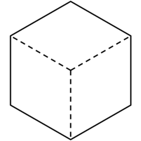
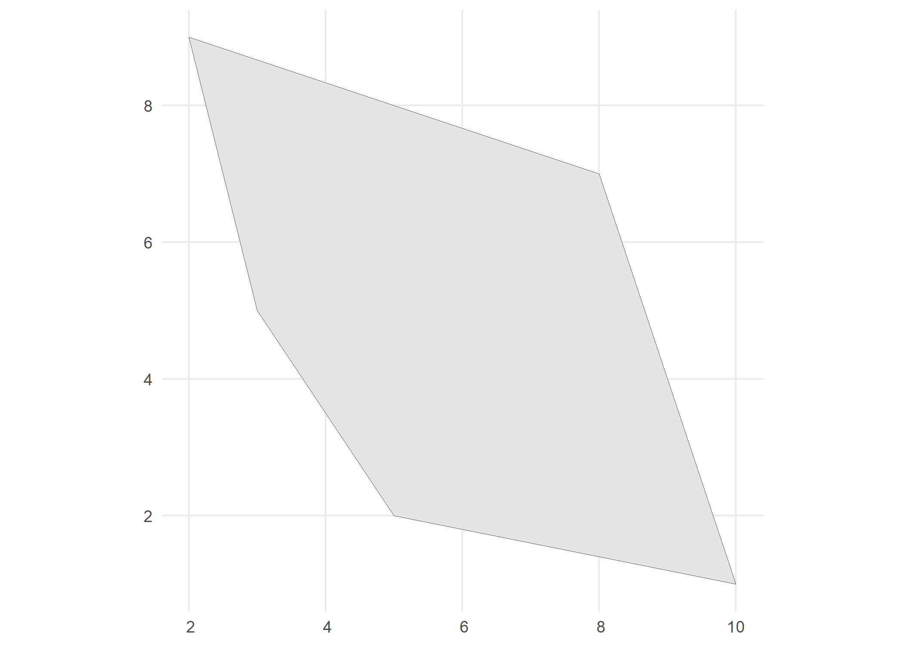
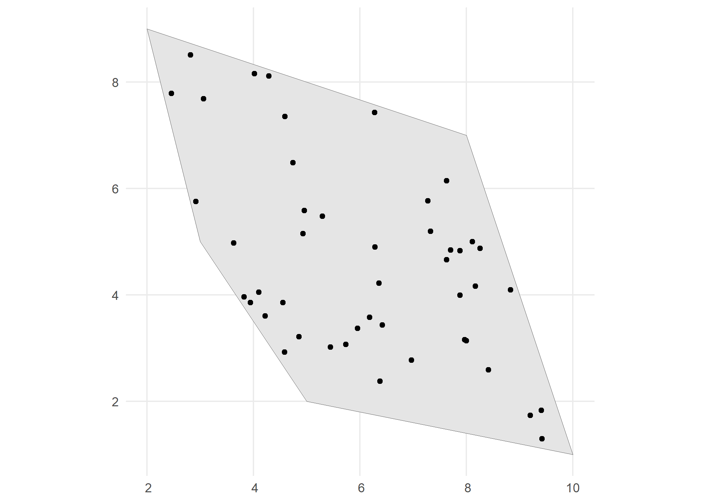
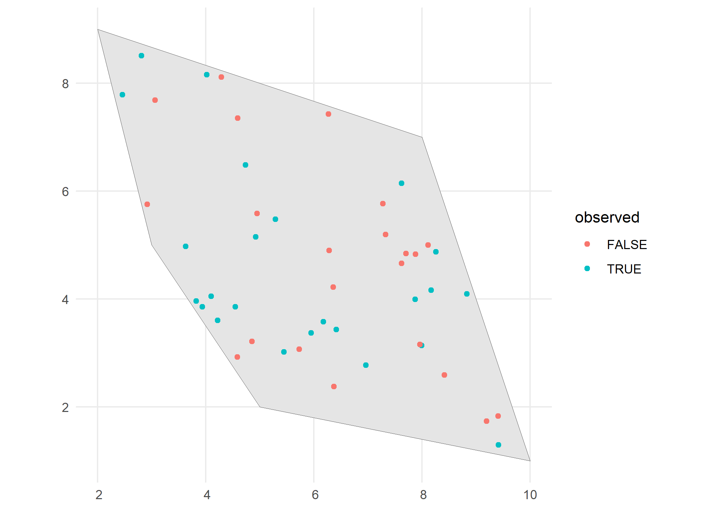
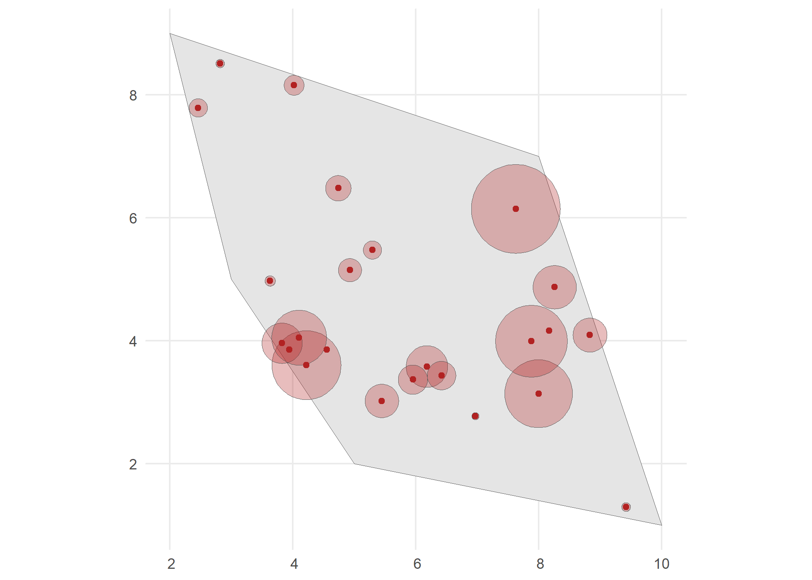
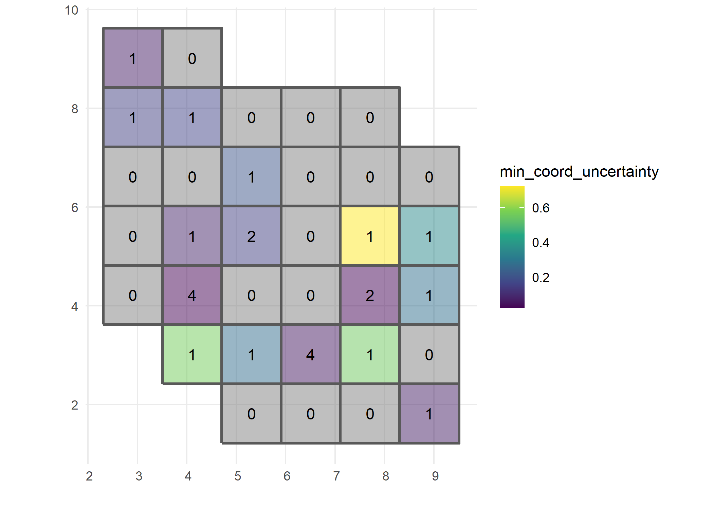

<!-- README.md is generated from README.Rmd. Please edit that file -->

# gcube <a href="https://b-cubed-eu.github.io/gcube/"></a>

<!-- badges: start -->

[](https://www.repostatus.org/#active)
[](https://github.com/b-cubed-eu/gcube/releases)
[](https://b-cubed-eu.r-universe.dev/gcube)
[](https://CRAN.R-project.org/package=gcube)
[](https://github.com/b-cubed-eu/gcube/actions/workflows/check_on_different_r_os.yml)
[](https://app.codecov.io/gh/b-cubed-eu/gcube/)
[](https://doi.org/10.5281/zenodo.14038996)
[](https://b-cubed-eu.r-universe.dev/)

<!-- badges: end -->

The goal of **gcube** is to provide a simulation framework for
biodiversity data cubes using the R programming language. This can start
from simulating multiple species distributed in a landscape over a
temporal scope. In a second phase, the simulation of a variety of
observation processes and effort can generate actual occurrence
datasets. Based on their (simulated) spatial uncertainty, occurrences
can then be designated to a grid to form a data cube.

Simulation studies offer numerous benefits due to their ability to mimic
real-world scenarios in controlled and customizable environments.
Ecosystems and biodiversity data are very complex and involve a
multitude of interacting factors. Simulations allow researchers to model
and understand the complexity of ecological systems by varying
parameters such as spatial and/or temporal clustering, species
prevalence, etc.

## Installation

Install **gcube** in R:

``` r
install.packages("gcube", repos = "https://b-cubed-eu.r-universe.dev")
```

You can install the development version from
[GitHub](https://github.com/) with:

``` r
# install.packages("remotes")
remotes::install_github("b-cubed-eu/gcube")
```

## Package name rationale and origin story

The name **gcube** stands for “generate cube” since it can be used to
generate biodiversity data cubes from minimal input. It was first
developed during the hackathon “Hacking Biodiversity Data Cubes for
Policy”, where it won the first price in the category “Visualization and
training”. You can read the full story here:
<https://doi.org/10.37044/osf.io/vcyr7>

## Example

This is a basic example which shows the workflow for simulating a
biodiversity data cube. It is divided in three steps or processes:

1.  Occurrence process
2.  Detection process
3.  Grid designation process

The functions are set up such that a single polygon as input is enough
to go through this workflow using default arguments. The user can change
these arguments to allow for more flexibility.

``` r
# Load packages
library(gcube)

library(sf)      # working with spatial objects
library(dplyr)   # data wrangling
library(ggplot2) # visualisation with ggplot
```

We create a polygon as input. It represents the spatial extend of the
species.

``` r
# Create a polygon to simulate occurrences within
polygon <- st_polygon(list(cbind(c(5, 10, 8, 2, 3, 5), c(2, 1, 7,9, 5, 2))))

# Visualise
ggplot() + 
  geom_sf(data = polygon) +
  theme_minimal()
```



### Occurrence process

We generate occurrence points within the polygon using the
`simulate_occurrences()` function. In this function, the user can
specify different levels of spatial clustering, and define the trend of
number of occurrences over time. The default is a random spatial pattern
and a single time point with `rpois(1, 50)` occurrences.

``` r
# Simulate occurrences within polygon
occurrences_df <- simulate_occurrences(
  species_range = polygon,
  initial_average_occurrences = 50,
  spatial_pattern = c("random", "clustered"),
  n_time_points = 1,
  seed = 123)
#> [using unconditional Gaussian simulation]

# Visualise
ggplot() + 
  geom_sf(data = polygon) +
  geom_sf(data = occurrences_df) +
  theme_minimal()
```



### Detection process

In the second step we define the sampling process, based on the
detection probability of the species and the sampling bias. This is done
using the `sample_observations()` function. The default sampling bias is
`"no_bias"`, but bias can be added using a polygon or a grid as well.

``` r
# Detect occurrences
detections_df_raw <- sample_observations(
  occurrences = occurrences_df,
  detection_probability = 0.5,
  sampling_bias = c("no_bias", "polygon", "manual"),
  seed = 123)

# Visualise
ggplot() + 
  geom_sf(data = polygon) +
  geom_sf(data = detections_df_raw,
          aes(colour = sampling_status)) +
  theme_minimal()
```



We select the detected occurrences and add an uncertainty to these
observations. This can be done using the `filter_observations()` and
`add_coordinate_uncertainty()` functions, respectively.

``` r
# Select detected occurrences only
detections_df <- filter_observations(
  observations_total = detections_df_raw)

# Add coordinate uncertainty
set.seed(123)
coord_uncertainty_vec <- rgamma(nrow(detections_df), shape = 2, rate = 6)
observations_df <- add_coordinate_uncertainty(
  observations = detections_df,
  coords_uncertainty_meters = coord_uncertainty_vec)

# Created and sf object with uncertainty circles to visualise
buffered_observations <- st_buffer(
  observations_df,
  observations_df$coordinateUncertaintyInMeters)

# Visualise
ggplot() + 
  geom_sf(data = polygon) +
  geom_sf(data = buffered_observations,
          fill = alpha("firebrick", 0.3)) +
  geom_sf(data = observations_df, colour = "firebrick") +
  theme_minimal()
```



### Grid designation process

Finally, observations are designated to a grid with `grid_designation()`
to create an occurrence cube. We create a grid over the spatial extend
using `sf::st_make_grid()`.

``` r
# Define a grid over spatial extend
grid_df <- st_make_grid(
    buffered_observations,
    square = TRUE,
    cellsize = c(1.2, 1.2)
  ) %>%
  st_sf() %>%
  mutate(intersect = as.vector(st_intersects(geometry, polygon,
                                             sparse = FALSE))) %>%
  dplyr::filter(intersect == TRUE) %>%
  dplyr::select(-"intersect")
```

To create an occurrence cube, `grid_designation()` will randomly take a
point within the uncertainty circle around the observations. These
points can be extracted by setting the argument `aggregate = FALSE`.

``` r
# Create occurrence cube
occurrence_cube_df <- grid_designation(
  observations = observations_df,
  grid = grid_df,
  seed = 123)

# Get sampled points within uncertainty circle
sampled_points <- grid_designation(
  observations = observations_df,
  grid = grid_df,
  aggregate = FALSE,
  seed = 123)

# Visualise grid designation
ggplot() +
  geom_sf(data = occurrence_cube_df, linewidth = 1) +
  geom_sf_text(data = occurrence_cube_df, aes(label = n)) +
  geom_sf(data = buffered_observations,
          fill = alpha("firebrick", 0.3)) +
  geom_sf(data = sampled_points, colour = "blue") +
  geom_sf(data = observations_df, colour = "firebrick") +
  labs(x = "", y = "", fill = "n") +
  theme_minimal()
```


The output gives the number of observations per grid cell and minimal
coordinate uncertainty per grid cell.

``` r
# Visualise minimal coordinate uncertainty
ggplot() +
  geom_sf(data = occurrence_cube_df, aes(fill = min_coord_uncertainty),
          alpha = 0.5, linewidth = 1) +
  geom_sf_text(data = occurrence_cube_df, aes(label = n)) +
  scale_fill_continuous(type = "viridis") +
  labs(x = "", y = "") +
  theme_minimal()
```



### Cubes for multiple species

Each cube simulation function mentioned earlier has a corresponding
mapping function. These mapping functions are designed to handle
operations for multiple species simultaneously by using the
`purrr::pmap()` function. Please consult the documentation for detailed
information on how these mapping functions are implemented.

| single species               | multiple species                 |
|------------------------------|----------------------------------|
| simulate_occurrences()       | map_simulate_occurrences()       |
| sample_observations()        | map_sample_observations()        |
| filter_observations()        | map_filter_observations()        |
| add_coordinate_uncertainty() | map_add_coordinate_uncertainty() |
| grid_designation()           | map_grid_designation()           |
